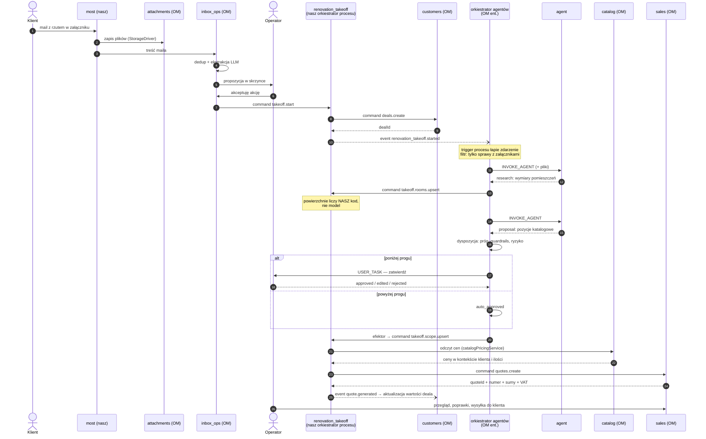

# 00 — Przepływ krok po kroku (dla zespołu)

**Spec**: Przedmiar remontowy → wycena (wariant uproszczony)
**Date**: 2026-09-19
**Kontekst**: pierwszy dokument z opracowania wariantu uproszczonego; pozostałe części (zakres, model danych, kontrakty, fazy) trafią osobnym PR-em.

> Dokument poglądowy do omówienia na spotkaniu. Pokazuje, **co się dzieje po kolei** i **czym moduły się ze sobą komunikują**. Kontrakty tras i komend oraz model danych są w dalszych częściach opracowania, poza tym PR-em.
>
> Opisuje wariant uproszczony. W wariancie pełnym między krokiem 8 a 11 dochodzą jeszcze receptury i osobny kosztorys.

## Cztery mechanizmy komunikacji

Wszystko poniżej to kombinacja tych czterech. Nic więcej nie ma.

| Mechanizm | Co robi | Kto o kim wie |
|---|---|---|
| **Command** | Jedyny dozwolony sposób zapisu do bazy. Daje audyt, undo, przeliczenie sum, blokadę wersji | Wołający zna nazwę komendy; właściciel danych nie wie, kto ją woła |
| **Event** | Powiadomienie „coś się stało" | **Nadawca nie wie, kto słucha.** To jest cała wartość |
| **Trigger procesu** | Definicja procesu deklaruje, na które zdarzenie reaguje | Proces zna zdarzenie; moduł emitujący nie zna procesu |
| **UMES** | Dokłada pola, panele i kolumny do cudzego modułu bez edycji jego kodu | Rozszerzający zna rozszerzanego; rozszerzany nie wie o niczym |

**Zasada nadrzędna:** agent nigdy nie zapisuje do bazy sam. Proponuje. Zapis wykonuje komenda, po zatwierdzeniu — automatycznym lub ludzkim.

## Przepływ: od maila do oferty



## Te same kroki opisem

| # | Co się dzieje | Kto inicjuje | Mechanizm | Co powstaje |
|---|---|---|---|---|
| 1 | Mail z rzutem trafia na adres skrzynki | klient | webhook | — |
| 2 | Most parsuje MIME i zapisuje pliki | nasz moduł | wywołanie `StorageDriver` | rekordy `Attachment` |
| 3 | Treść maila trafia do skrzynki, dedup po `messageId` | `inbox_ops` | — | `InboxEmail` |
| 4 | LLM czyta treść i proponuje akcję „załóż sprawę remontową" | `inbox_ops` | — | propozycja w skrzynce |
| 5 | Operator akceptuje akcję | człowiek | — | — |
| 6 | Silnik wykonania woła naszą komendę | `inbox_ops` | **command** `renovation_takeoff.takeoff.start` | — |
| 7 | Nasza komenda zakłada sprawę w CRM | nasz moduł | **command** `customers.deals.create` | `CustomerDeal` z adresem obiektu i identyfikatorami załączników |
| 8 | Nasza komenda ogłasza, że sprawa ruszyła | nasz moduł | **event** `renovation_takeoff.started` | — |
| 9 | Definicja procesu łapie zdarzenie i startuje wykonanie | orkiestrator agentów | **trigger** (filtr: tylko z załącznikami) | `WorkflowInstance` |
| 10 | Agent czyta załączone pliki | orkiestrator agentów | krok `INVOKE_AGENT` | wynik `research` — **wymiary**, nie powierzchnie |
| 11 | Aktywność zapisuje pomieszczenia | orkiestrator agentów | **command** `takeoff.rooms.upsert` | `TakeoffRoom` + policzone powierzchnie |
| 12 | Drugi agent proponuje pozycje z cennika | orkiestrator agentów | krok `INVOKE_AGENT` | wynik `proposal` — N wariantów zakresu |
| 13 | Decyzja: automat czy człowiek | orkiestrator agentów | dyspozycja | `auto_approved` albo zadanie dla operatora |
| 14 | Nasz efektor wykonuje zatwierdzone akcje | nasz moduł | **command** `takeoff.scope.upsert` | `TakeoffScopeItem` |
| 15 | Wycena pozycji po cenniku | nasz moduł | odczyt + `catalogPricingService` | ceny w kontekście klienta, ilości i daty |
| 16 | Powstaje dokument oferty | nasz moduł | **command** `sales.quotes.create` | `SalesQuote` z numerem, VAT-em i sumami |
| 17 | Wartość sprawy w CRM aktualizuje się | nasz moduł | **event** → **command** `customers.deals.update` | forecast w lejku |
| 18 | Operator przegląda, poprawia, wysyła | człowiek | UI `sales` | oferta u klienta |

## Co dokładnie musi być zmapowane

Między wynikiem agenta a gotową linią oferty są **trzy przekształcenia**. Mylenie ich ze sobą jest głównym źródłem nieporozumień, bo sporne jest tylko jedno.

| # | Z czego | Na co | Gdzie żyje | Czyste (testowalne bez bazy) |
|---|---|---|---|---|
| **M1** | wynik agenta (JSON) | `TakeoffRoom[]`, `TakeoffScopeItem[]` | efektor + komendy `rooms.upsert` / `scope.upsert` | nie — zapis, scope, walidacja |
| **M2** | pomieszczenie + `quantityBasis` | `quantity` + `unitCode` | strategia ilości | **tak** |
| **M3** | pozycja zakresu + cena z `catalog` | linia dla `sales.quotes.create` | mapper linii | **tak** |

M1 i M3 wyglądają tak samo w obu wariantach poniżej. **Różnica dotyczy wyłącznie M2.**

W wariancie pełnym między M2 a M3 siedzi jeszcze rozwijanie receptur (jedna robota → N pozycji katalogowych z nakładami i odpadem). Tutaj tego kroku nie ma: pozycja zakresu wskazuje pozycję katalogową wprost, więc M2 wpada prosto w M3.

### M3 — czego wymaga linia oferty

Ze schematu `quoteLineCreateSchema` wymagane są dokładnie dwa pola: `quantity` i `currencyCode`. Reszta opcjonalna, ale wypełniamy:

| Pole linii `sales` | Źródło |
|---|---|
| `quantity` | `TakeoffScopeItem.quantity` |
| `quantityUnit` | `TakeoffScopeItem.unit_code` |
| `currencyCode` | waluta wyceny, powielona na każdą linię |
| `kind` | `service` dla robót, `product` dla materiału |
| `productId` / `productVariantId` | `catalog_product_id` / `catalog_variant_id` |
| `name` | `catalog_snapshot.title` |
| `unitPriceNet` | rozstrzygnięcie `catalogPricingService` |
| `taxRate` / `taxRateId` | z produktu |
| `catalogSnapshot` | `TakeoffScopeItem.catalog_snapshot` |

Trzy reguły mappera:

1. **Sum nie przekazujemy.** `totalNetAmount`, `grandTotalNetAmount` i reszta są opcjonalne — liczy je `salesCalculationService`. Podanie własnych daje dwa źródła prawdy.
2. **`kind` nie zna materiału.** Enum to `product | service | shipping | discount | adjustment`. Materiał i sprzęt mapują się na `product`.
3. **Pozycja bez ceny wymaga jawnej decyzji.** Zero i ostrzeżenie (wybór do zapisania w słowniku domenowym) albo odrzucenie przed wywołaniem `sales`. Milczące przepuszczenie = oferta za darmo.

---

### Wariant A — agent liczy powierzchnię, my mapujemy na cenę

Agent oddaje gotową ilość. M2 nie istnieje.

```json
{
  "kind": "proposal",
  "data": {
    "scope": [
      { "room": "Salon", "catalogProductId": "…", "quantity": 44.175, "unitCode": "m2" },
      { "room": "Salon", "catalogProductId": "…", "quantity": 21.32,  "unitCode": "m2" },
      { "room": null,    "catalogProductId": "…", "quantity": 1,      "unitCode": "kpl" }
    ]
  }
}
```

Pozycja zapisuje się z `quantityBasis = 'manual'`. Pomieszczenia albo nie powstają wcale, albo powstają jako zapis informacyjny bez wpływu na ilości.

**Za:** jedno wywołanie agenta zamiast dwóch; agent radzi sobie z rzeczami, których nasza geometria nie opisuje (skosy, wnęki, sufit podwieszany, powierzchnia z opisu „ok. 45 m² ścian").
**Przeciw:** liczba 44,175 nie ma pochodzenia. Zmiana wysokości pomieszczenia nie przelicza niczego. Nikt nie odtworzy, czy model odjął otwory. Błąd arytmetyczny modelu wychodzi dopiero po podpisaniu oferty.

### Wariant B — agent zwraca dane, powierzchnię liczy nasz kod

Agent oddaje wymiary i **bazę ilości**, nie liczbę.

```json
{
  "kind": "research",
  "data": {
    "rooms": [{
      "name": "Salon",
      "lengthM": 5.2, "widthM": 4.1, "heightM": 2.7,
      "openings": [
        { "kind": "window", "widthM": 1.5, "heightM": 1.4,  "count": 2 },
        { "kind": "door",   "widthM": 0.9, "heightM": 2.05, "count": 1 }
      ]
    }]
  }
}
```

```json
{
  "kind": "proposal",
  "data": {
    "scope": [
      { "room": "Salon", "catalogProductId": "…", "quantityBasis": "wall_area" },
      { "room": "Salon", "catalogProductId": "…", "quantityBasis": "floor_area" },
      { "room": null,    "catalogProductId": "…", "quantityBasis": "manual", "quantity": 1, "unitCode": "kpl" }
    ]
  }
}
```

Nasz kod liczy:

```
perimeterM    = 2 * (5.2 + 4.1)                      = 18.6
wallAreaNetM2 = 18.6 * 2.7 − (1.5*1.4*2 + 0.9*2.05)  = 50.22 − 6.045 = 44.175
floorAreaM2   = 5.2 * 4.1                            = 21.32
```

**Za:** każda ilość ma pochodzenie i da się ją odtworzyć z wymiarów. Korekta wymiaru przelicza wszystkie zależne pozycje. Arytmetyka jest testowana jednostkowo raz, nie oceniana per przebieg agenta. Model odpowiada wyłącznie za odczyt i dopasowanie — to, w czym jest dobry.
**Przeciw:** dwa wywołania agenta zamiast jednego. Kształty spoza naszej geometrii (skos, wnęka) wymagają albo ucieczki do `manual`, albo nowej bazy ilości.

### Porównanie

| Wymiar | A — agent liczy | B — my liczymy |
|---|---|---|
| Ślad pochodzenia ilości | brak | pełny |
| Korekta wymiaru przelicza ofertę | nie | tak |
| Ryzyko błędu arytmetycznego | model, przy każdym przebiegu | kod, raz wyłapane testem |
| Wywołań agenta | 1 | 2 |
| Kształty spoza geometrii | natywnie | przez `manual` albo nową bazę |
| Co agent musi umieć | odczytać + zmierzyć + policzyć | odczytać + zmierzyć + dopasować |

---

## Wzorzec strategii — M2 jako punkt rozbudowy

Powierzchnia jest pierwszym typem, nie jedynym. `quantityBasis` jest tym szwem: dodanie nowego rodzaju wyliczenia to nowy wpis w rejestrze, bez dotykania M1 i M3.

```ts
export type QuantityBasis = 'wall_area' | 'floor_area' | 'perimeter' | 'count' | 'manual'

export type RoomGeometry = {
  lengthM: number; widthM: number; heightM: number
  openings: { widthM: number; heightM: number; count: number }[]
}

export type QuantityStrategy = {
  basis: QuantityBasis
  unitCode: string
  requiresRoom: boolean
  compute(input: { room: RoomGeometry | null; manualQuantity?: number }):
    { quantity: number; warnings: string[] }
}

export const QUANTITY_STRATEGIES: Record<QuantityBasis, QuantityStrategy>
```

Konsekwencje:

- **Wariant A to nie inna architektura — to jedna strategia.** `manual` przepuszcza ilość podaną z zewnątrz. Oba warianty współistnieją w tym samym kodzie. Wybór A kontra B jest decyzją o tym, **co agentowi wolno wyemitować**, czyli elementem słownika akcji i guardraili, nie kształtu modułu.
- **Nowy rodzaj mapowania = nowy wpis + test.** Kandydaci na później: `ceiling_area`, `wall_length` (listwy, cokoły — mb), `opening_count` (wymiana okien — szt), `volume` (wywóz gruzu — m³).
- **M1 tylko przenosi `basis`, nie interpretuje go.** M3 nie wie, że strategie istnieją — dostaje gotową parę ilość + jednostka.
- **Strategia nieznana w ładunku → 400, nigdy cicha zamiana na `manual`.** Milcząca degradacja daje ofertę z ilością wziętą znikąd.

**Otwarte:** który wariant jest domyślny dla agenta. Rekomendacja: **B**, z `manual` dopuszczonym wyłącznie tam, gdzie geometria nie ma zastosowania, i z ostrzeżeniem na pozycji `manual` pochodzącej od agenta — żeby człowiek widział, czego nie da się odtworzyć.

## Kto z kim rozmawia i czym

| Nasz moduł → | Czym | Po co |
|---|---|---|
| `customers` | command + gołe `dealId` | założenie sprawy, aktualizacja wartości |
| `catalog` | odczyt encji + usługa DI | ceny, jednostki, przeliczniki |
| `sales` | command | utworzenie dokumentu oferty |
| `sales` | UMES (enricher + widget) | panel „Przedmiar" na stronie wyceny |
| `attachments` | `StorageDriver`, OCR | zapis i odczyt plików z maila |
| `inbox_ops` | plik `inbox-actions.ts` | zgłoszenie akcji „załóż sprawę" do skrzynki |
| `workflows` | rejestracja komend workflow-safe | wskazanie, co agent może wykonać |

| → Nasz moduł | Czym | Uwaga |
|---|---|---|
| `inbox_ops` | wywołanie naszej komendy | poczta **nie wie**, że istnieje warstwa AI |
| orkiestrator | efektor + komendy workflow-safe | agent **nie wie**, jak wygląda nasza baza |

Żaden moduł Open Mercato nie ma w kodzie odwołania do naszego. Wszystkie wejścia idą przez rejestry: plik akcji skrzynki i katalog komend.

## Trzy rzeczy, które warto powiedzieć zespołowi głośno

1. **Agent nigdy nie pisze do bazy.** Proponuje; zapis idzie komendą po zatwierdzeniu. Zabezpiecza to strażnik w platformie, nie nasza dyscyplina. Każdy taki zapis da się cofnąć.
2. **Powierzchnie liczy nasz kod, nie model.** Agent zwraca wymiary z rysunku. Pomyłka modelu w arytmetyce to zła oferta finansowa, a to jest ryzyko, którego nie kupujemy.
3. **Fazy 1–2 to działający produkt.** Mail i AI są nadbudową. Jeśli enterprise się opóźni albo agent okaże się nieskuteczny, kosztorysant i tak pracuje szybciej niż w arkuszu.
