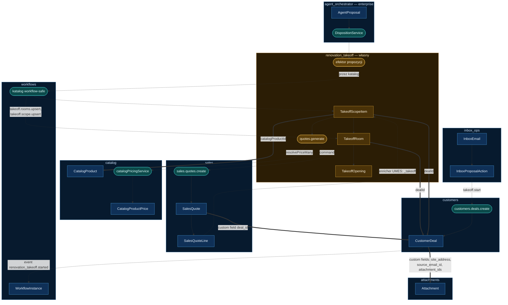

# 02 — Architektura, granice i model danych

**Spec**: Przedmiar remontowy → wycena (wariant uproszczony)
**Date**: 2026-09-19
**Status**: Draft
**Indeks**: [README.md](./README.md) · **Poprzedni**: [01 — Przegląd](./01-overview.md) · **Następny**: [03 — API, zdarzenia, UI](./03-api-events-ui.md)

> Słownik domenowy, uprawnienia, co jest cudze a co własne, diagram zależności i trzy tabele modułu.

## Domain Vocabulary and Business Rules

| Term / invariant | Precise meaning or rule | Source of truth | Failure behavior |
|---|---|---|---|
| Sprawa remontowa | `CustomerDeal` z custom fieldem `deal_kind = 'renovation'` | `customers.CustomerDeal` | brak dyskryminatora → deal nie jest widoczny w module i nie startuje procesu |
| Adres obiektu | Custom field `site_address` na dealu; różny od adresu klienta | EAV `E.customers.customer_deal` | brak → przedmiar działa, ostrzeżenie w UI |
| Pomieszczenie | `lengthM`, `widthM`, `heightM` > 0, ≤ 999 | `TakeoffRoom` | wymiar poza zakresem → 400 |
| Otwór | Okno albo drzwi: `widthM`, `heightM` > 0, `count` ≥ 1 | `TakeoffOpening` | — |
| Powierzchnia podłogi | `floorAreaM2 = lengthM * widthM` | wyliczane i zapisywane przy każdej zmianie | — |
| Powierzchnia ścian netto | `wallAreaNetM2 = 2*(lengthM+widthM)*heightM − Σ(widthM*heightM*count)`; wynik ≤ 0 zapisuje się jako 0 | wyliczane i zapisywane przy każdej zmianie | wynik ≤ 0 → 0 + wpis w `warnings` pomieszczenia |
| Zaokrąglenie | Ilości do 4 miejsc, half-up | konwencja modułu | — |
| Pozycja zakresu | Para (pomieszczenie lub sprawa, pozycja katalogowa) z ilością i jednostką; ilość `derived` z geometrii albo `manual` | `TakeoffScopeItem` | pozycja katalogowa spoza scope → 400 |
| Baza ilości | `quantityBasis` ∈ `wall_area` \| `floor_area` \| `perimeter` \| `count` \| `manual`; określa, z czego wyliczyć ilość | `TakeoffScopeItem` | `manual` wymaga podanej `quantity` |
| Wycena | `SalesQuote` z custom fieldem `deal_id`; wiele wycen na jeden deal | `sales.SalesQuote` | — |
| Wersja aktualna | Wycena o najwyższym `created_at` wśród nieodrzuconych; wskaźnik wyliczany, nie przechowywany | zapytanie | — |
| Snapshot ceny | Linia wyceny niesie `unit_price_net`, `tax_rate` i `catalog_snapshot` z chwili generowania | `sales.SalesQuoteLine` | brak ceny → linia z zerem + ostrzeżenie w wyniku generowania |
| Status `proposed` | Wartość dodana do słownika statusów wyceny; oznacza dokument wygenerowany przez agenta, przed przeglądem człowieka | słownik `sales` | patrz Risks — nie jest egzekwowany strażnikiem |

## Users, Permissions, and Scope

| Actor | Allowed outcomes | Scope rule | Required feature IDs |
|---|---|---|---|
| Kosztorysant | Prowadzi przedmiar i zakres, generuje wycenę | organization | `renovation_takeoff.takeoff.view`, `renovation_takeoff.takeoff.manage`, `renovation_takeoff.quotes.generate`, `customers.deals.*`, `sales.quotes.*` |
| Kierownik | To co kosztorysant plus wysyłka oferty | organization | + `sales.quotes.send` |
| Principal agenta | Wykonuje zaakceptowane propozycje przez efektor | organization, least-privilege z `WorkflowDefinition.grantedFeatures` | podzbiór z `allowedActions` ∩ katalog workflow-safe |

`tenantId` i `organizationId` wypełnia trasa z `ctx.auth`; komenda asertuje je wobec kontekstu aktora (`ensureTenantScope`, `commandActorScope`) — idiom `catalog` i `sales`. Każde zapytanie ORM filtruje po obu polach. Brak kontekstu = odmowa. Żaden przepływ nie używa scope systemowego.

## Reuse and Ownership Map

| Capability | Reuse / extend / app-own | Existing module or new module | Integration seam | Why |
|---|---|---|---|---|
| Sprawa, lejek, timeline, kontakt, forecast | reuse | `customers` | komenda `customers.deals.create`, gołe uuid `dealId` | pełne pokrycie CRM |
| Pola sprawy specyficzne dla remontu | extend (UMES) | `customers` | custom fields przez `ce.ts` na `E.customers.customer_deal` | brak migracji, brak dotykania installed |
| Wycena, numeracja, statusy, VAT, sumy, wysyłka, akceptacja | reuse | `sales` | komenda `sales.quotes.create` | linia ma ilość ułamkową, jednostkę i snapshot katalogu |
| Powiązanie wyceny ze sprawą | extend (UMES) | `sales` | custom field `deal_id` na `E.sales.sales_quote` | `sales_quotes` nie ma kolumny na deala |
| Widoczność przedmiaru na wycenie | extend (UMES) | `sales` | `ResponseEnricher` na `E.sales.sales_quote` + widget | `sales` nie zyskuje zależności |
| Cennik, jednostki, przeliczniki, rozstrzyganie ceny | reuse | `catalog` | import encji + DI `catalogPricingService` | precedens: `catalog` importuje `SalesChannel` z `sales` |
| Mail, dedup, ekstrakcja, UI propozycji | reuse | `inbox_ops` | discovery file `inbox-actions.ts` | `promptSchema` akcji trafia do promptu ekstrakcji |
| Pliki, OCR, routing storage | reuse | `attachments` | `StorageDriver`, `OcrService` | scoping i szyfrowanie po stronie modułu |
| Parser MIME i limity załączników | reuse (biblioteka) | `communication_channels` | import `lib/email-mime.ts` | gotowy parser |
| Runtime agenta, trace, guardrails, dyspozycja | reuse | `agent_orchestrator` (enterprise) | `agentRuntime`, `dispositionService` | propose-only wymuszone przez `agentNoBypassSubscriber` |
| Durable execution, katalog akcji | reuse | `workflows` | `registerWorkflowSafeCommands` | trzy bramki: rejestracja → włączenie per tenant → ACL aktora |
| Efektor propozycji | app-own | `renovation_takeoff` | `executeProposal` + własna `actionCommandMap` | `commands/dispose.ts` nie wykonuje efektu |
| **Przedmiar: pomieszczenia, otwory, zakres** | **app-own** | **`renovation_takeoff`** | — | **brak pokrycia w installed** |
| Most załączników mail → attachments | app-own | `renovation_takeoff` | webhook + `lib/email-mime.ts` | `inbox_ops` nie zapisuje załączników |

Trzy własne tabele. Wszystko inne to cudze rekordy i cudze komendy.

## Architecture and Data Flow

```text
mail + załączniki -> most webhooka -> Attachment[] + InboxEmail
                                   -> akcja inbox -> renovation_takeoff.takeoff.start
                                                     -> customers.deals.create (CustomerDeal)
                                                     -> event renovation_takeoff.started
event -> ProcessDefinition -> WorkflowInstance -> agent (research: wymiary)
                                               -> nasz kod: TakeoffRoom[] + powierzchnie
                                               -> agent (proposal: pozycje katalogowe)
                                               -> dyspozycja -> nasz efektor -> TakeoffScopeItem[]
TakeoffScopeItem[] -> wycena przez catalogPricingService -> sales.quotes.create -> SalesQuote(+Line[])
```



Legenda: **bursztynowe** — encje i usługi modułu własnego, **niebieskie** — encje installed, **turkusowe** — komendy i usługi installed. Gruba linia ciągła to powiązanie międzymodułowe gołym UUID lub custom fieldem; przerywana to wywołanie w runtime.

- **Module boundaries:** moduł własny posiada jeden niezmiennik — „ilość pozycji zakresu wynika z geometrii pomieszczenia albo z ręcznego nadpisania". Nie posiada sprawy ani dokumentu; oba należą do installed.
- **Extension points:** custom fields na `E.customers.customer_deal` i `E.sales.sales_quote`, `ResponseEnricher` na `E.sales.sales_quote`, widget na stronie wyceny, `inbox-actions.ts`, `registerWorkflowSafeCommands`.
- **Alternatives considered:** trzymanie przedmiaru jako jsonb w custom fieldzie na dealu. Odrzucone: przedmiar to kolekcja rekordów z własnym CRUD-em, sortowaniem i walidacją per wiersz; jsonb odbiera `DataTable`, walidację i sensowne błędy.
- **Compatibility:** zero zmian w kontraktach installed. Wszystkie powiązania to gołe UUID albo custom fields. Enricher `critical: false` z `fallback`.

## Data Models

### `TakeoffRoom` — `renovation_takeoff`

| Field | Type / nullability | Scope / index | Sensitive | Lifecycle and validation |
|---|---|---|---|---|
| `id` | UUID, required | primary key | no | immutable |
| `organization_id` / `tenant_id` | UUID, required | `(organization_id, tenant_id, deal_id)` index | no | z kontekstu auth, asertowane w komendzie |
| `deal_id` | UUID, required | index | no | `customer_deals.id`, bez FK, bez relacji ORM |
| `name` | text, required | — | no | 1–120 |
| `sort_order` | integer, default 0 | — | no | — |
| `length_m` / `width_m` / `height_m` | numeric(10,3), required | — | no | > 0, ≤ 999 |
| `floor_area_m2` | numeric(18,4), required | — | no | wyliczane w komendzie, nie przyjmowane z ładunku |
| `wall_area_net_m2` | numeric(18,4), required | — | no | wyliczane w komendzie; ≤ 0 zapisuje 0 |
| `perimeter_m` | numeric(18,4), required | — | no | wyliczane w komendzie |
| `warnings` | jsonb, nullable | — | no | ostrzeżenia wyliczeń |
| `notes` | text, nullable | — | no | ≤ 1000 |
| `created_at` / `updated_at` | timestamp, required | `updated_at` = wersja blokady optymistycznej | no | — |
| `deleted_at` | timestamp, nullable | partial index | no | soft delete, kaskada logiczna na otwory i zakres |

### `TakeoffOpening` — `renovation_takeoff`

`id`, `room_id` (FK intra-module, cascade delete), `organization_id`, `tenant_id`, `kind` (`window` \| `door`), `width_m` / `height_m` (numeric(10,3), > 0), `count` (integer ≥ 1), `label` (text, nullable), znaczniki czasu. Index `(organization_id, tenant_id, room_id)`.

Każda zmiana otworu przelicza `wall_area_net_m2` pomieszczenia w tej samej transakcji.

### `TakeoffScopeItem` — `renovation_takeoff`

| Field | Type / nullability | Scope / index | Sensitive | Lifecycle and validation |
|---|---|---|---|---|
| `id` | UUID, required | primary key | no | immutable |
| `organization_id` / `tenant_id` | UUID, required | `(organization_id, tenant_id, deal_id)` index | no | asertowane w komendzie |
| `deal_id` | UUID, required | index | no | gołe uuid |
| `room_id` | UUID, nullable | index | no | `null` = pozycja ogólnosprawowa (np. wywóz gruzu) |
| `catalog_product_id` | UUID, required | index | no | musi istnieć w `catalog_products` w tym samym scope |
| `catalog_variant_id` | UUID, nullable | — | no | gdy podany, musi należeć do produktu |
| `catalog_snapshot` | jsonb, required | — | no | `title`, `sku`, `default_unit` z chwili dodania |
| `quantity_basis` | text, required | — | no | `wall_area` \| `floor_area` \| `perimeter` \| `count` \| `manual` |
| `quantity` | numeric(18,6), required | — | no | > 0; dla bazy innej niż `manual` wyliczana z pomieszczenia i przeliczana przy zmianie wymiarów |
| `unit_code` | text, required | — | no | kanonizowane przez `canonicalizeUnitCode` |
| `sort_order` | integer, default 0 | — | no | — |
| `notes` | text, nullable | — | no | ≤ 1000 |
| `created_at` / `updated_at` | timestamp, required | `updated_at` = wersja blokady | no | — |
| `deleted_at` | timestamp, nullable | partial index | no | soft delete |

Unique częściowy `(deal_id, room_id, catalog_product_id)` gdzie `deleted_at IS NULL` — ta sama pozycja katalogowa raz na pomieszczenie. Powtórzenie roboty w tym samym pomieszczeniu (dwie warstwy) realizuje się ilością, nie drugim wierszem.

### Custom fields na encjach installed

| Encja | Pole | Typ | Uwaga |
|---|---|---|---|
| `E.customers.customer_deal` | `deal_kind` | text | dyskryminator; `renovation` włącza moduł na tym dealu |
| `E.customers.customer_deal` | `site_address` | jsonb / text | adres obiektu; **patrz Q-L-001 — szyfrowanie pól EAV** |
| `E.customers.customer_deal` | `source_email_id` | uuid | `inbox_emails.id` |
| `E.customers.customer_deal` | `attachment_ids` | jsonb | tablica uuid z `attachments` |
| `E.customers.customer_deal` | `workflow_instance_id` | uuid | bieżące wykonanie procesu |
| `E.sales.sales_quote` | `deal_id` | uuid | zbiera wersje wyceny pod sprawą |
| `E.sales.sales_quote` | `takeoff_snapshot_at` | timestamp | kiedy wycena została wygenerowana z przedmiaru |

### Migracje i retencja

Trzy tabele, jedna migracja na fazę. `yarn db:generate`, przegląd SQL i snapshotu, aplikacja osobną decyzją. Żadna migracja nie dotyka tabel installed. Retencja idzie za dealem: usunięcie deala nie kasuje przedmiaru automatycznie — subscriber na `customers.deal.deleted` soft-deletuje powiązane wiersze.
